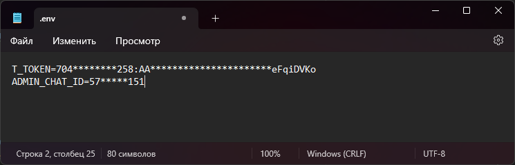
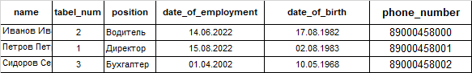

# Birtday_bot

## О проекте:
Телеграм-бот - напоминалка о днях рождения сотрудников компании. Напоминание приходит только зарегистрированным пользователям. Администратор имеет возмможность добавления/удаления/редактирования сотрудников. 

## Стек технологий:
- Python 3.9
- SQLite3
- PyTelegramBotAPI

## Запуск проекта:
1. Клонируйте репозиторий
```console
git clone git@github.com:TatarnikovSergey/birthday_bot.git
```

2. В корневой папке проекта создайте файл .env со следующими данными:



где T_TOKEN - токен вашего телеграм бота, ADMIN_CHAT_ID - телеграм id администратора бота

3. Создайте и активируйте виртуальное окружение, установите зависимости.

4. В файле parameters.py укажите сведения для импорта и константы для работы бота.
5. Для создания таблиц СУБД SQLite3 необходимо запустить скрипт:
```console
python insert_to_db.py
``` 
При этом столбцы исходной excel таблицы с данными сотрудников должны именоваться следующим образом:



5. Запустите бот выполнив команду:
```console
python birthday.py
``` 

Автор: [TatarnikovSergey](https://github.com/TatarnikovSergey)